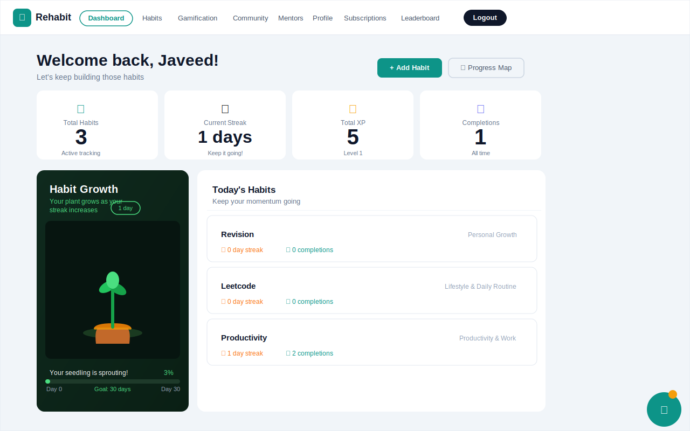

<div align="center">

<h1>🌱 reHabit</h1>

<p><strong>AI-Powered Habit Transformation Platform</strong></p>

<p>Build life-changing habits with the power of AI, gamification, and social accountability — all in one beautifully crafted platform.</p>

[](LICENSE)
[](https://nodejs.org/)
[](https://react.dev/)
[](https://mongoosejs.com/)
[](https://tailwindcss.com/)
[](https://openai.com/)
[](https://socket.io/)
[](https://vitejs.dev/)

</div>

---

## 📖 Table of Contents

- [About the Project](#-about-the-project)
- [Screenshots](#-screenshots)
- [Problem It Solves](#-problem-it-solves)
- [Key Features](#-key-features)
- [AI Habit Verification Engine](#-ai-habit-verification-engine)
- [Tech Stack](#-tech-stack)
- [Project Structure](#-project-structure)
- [Getting Started](#-getting-started)
- [Environment Variables](#-environment-variables)
- [API Endpoints](#-api-endpoints)
- [Gamification System](#-gamification-system)
- [AI Features](#-ai-features)
- [Future Improvements](#-future-improvements)
- [Known Issues](#-known-issues)
- [Contributing](#-contributing)
- [License](#-license)

---

## 🌟 About the Project

**reHabit** is a full-stack MERN application that combines intelligent AI mentoring, deep gamification mechanics, and a social motivation network to help users build and sustain meaningful daily habits.

Whether you're trying to exercise consistently, read more, or meditate daily — reHabit tracks your progress, rewards your consistency, connects you with like-minded people, and provides AI-driven insights to keep you on track.

---

## 📸 Screenshots

### 🏠 User Dashboard



> The dashboard gives you a real-time snapshot of your habit streak, XP, total completions, plant growth tied to your streak, today's habits, leaderboard position, AI insights, and activity heatmap — all in one view.

---

## 🧩 Problem It Solves

Most habit trackers are just checklists. People start strong, lose motivation, and abandon their goals.

**reHabit solves this by:**
- 🤖 Using **AI to personalize guidance** based on your behavior patterns
- 🔥 Making habits **fun and rewarding** through XP, badges, levels, and shops
- 👥 Building a **social accountability layer** with communities, challenges, and accountability partners
- 📊 Providing **deep analytics** so users understand their own patterns

**Target Users:** Students, professionals, fitness enthusiasts, productivity-focused individuals, and anyone who wants structured self-improvement with modern tooling.

---

## ✨ Key Features

### 🎯 Core Habit Tracking
- Create, edit, and delete habits with difficulty levels (easy / medium / hard)
- Track daily completions with a visual activity heatmap
- Per-habit streak counters and all-time completion statistics
- Today's habits dashboard with live progress view

### 🧠 AI-Verified Habit Completion _(Signature Feature)_
- Completing a habit is **not just a checkbox** — users must answer a habit-specific question generated by GPT-4
- The AI evaluates the answer for relevance, depth, and honesty
- Only verified completions award XP, coins, and streak progress
- Prevents fake check-ins and builds genuine accountability
- See [AI Habit Verification Engine](#-ai-habit-verification-engine) for full details

### 🤖 AI-Powered Intelligence
- **AI Habit Verification** — GPT-4 generates questions and validates answers before awarding XP (see [full details](#-ai-habit-verification-engine))
- **Emotion-Sensitive AI Mentor** — responds to your emotional state
- **Habit Correction Engine** — detects deviations and suggests fixes
- **Digital Twin Prediction Model** — forecasts your future performance
- **Weekly Insight Generator** — summarizes your week with actionable advice
- **AI Chatbot** — context-aware conversational assistant available 24/7
- **AI Social Feed** — sentiment analysis on posts, AI-generated supportive comments
- **Community Recommendation Engine** — matches users to communities via multi-factor AI scoring
- **Accountability Partner Matching** — pairs compatible users for mutual support

### 🎮 Gamification System
- **XP & Leveling** — 50 levels, earn XP per habit completion based on difficulty
- **Streaks** — fire animations for 7+, 14+, 30+ day streaks
- **12 BGMI-Style Badges** — Week Warrior, Conqueror, Legend, Unstoppable, and more
- **Coin Economy** — earn coins, spend them in the in-app shop
- **Shop** — 15 items: themes, avatar skins, accessories, and visual effects
- **Avatar Evolution** — 5 evolution stages tied to your level
- **Candy Crush-Style Level Map** — visual progression through all 50 levels
- **Global Leaderboard** — compete with all users by XP

### 👥 Social & Community
- Join and create Communities / Guilds
- Post progress updates, struggles, and wins
- React and comment on posts (with AI comment suggestions)
- Micro Support Circles — curated small groups for focused accountability
- Real-time chat with Socket.IO (typing indicators, online status)
- Friends system with activity feed

### 🧑‍🏫 Mentor System
- Browse certified mentors with ratings, specializations, and location
- Filter by category, online status, and proximity
- 3-tier subscription plans: **Basic**, **Duo**, **Family**
- Mentor plan management with session tracking

### 📊 Analytics & Insights
- Interactive charts for habit consistency and performance metrics
- Compact activity heatmap (GitHub-style)
- Plant growth visualization tied to streak count
- Level-up animations with confetti celebration

### 🔐 Auth & Admin
- JWT-based authentication with role management (user / mentor / admin)
- Admin dashboard with platform-wide analytics
- Secure role-based route guards

---

## 🧠 AI Habit Verification Engine

One of reHabit's core differentiators: **you cannot simply tick a box to complete a habit**. Every completion goes through an AI verification pipeline.

### How It Works

```
 User clicks "Complete Habit"
        │
        ▼
┌─────────────────────────────────┐
│  GPT-4 generates a habit-       │
│  specific verification question │
│  (e.g. "What did you revise     │
│  today and for how long?")      │
└─────────────┬───────────────────┘
              │
              ▼
     User submits their answer
              │
              ▼
┌─────────────────────────────────┐
│  AI Validation Engine           │
│  • Checks answer relevance      │
│  • Evaluates depth & honesty    │
│  • Scores 0–100                 │
│  • Score ≥ 60 = VERIFIED        │
└─────────────┬───────────────────┘
              │
    ┌─────────┴──────────┐
    │                    │
  PASS                 FAIL
    │                    │
    ▼                    ▼
Award XP,          Show feedback,
coins & streak     suggest retry
```

### Question Generation
GPT-4 receives the habit name, category, and difficulty, then generates a **contextually appropriate open-ended question**:

| Habit | Generated Question Example |
|---|---|
| Morning Run | *"How far did you run today and how did your body feel?"* |
| Meditate | *"What technique did you use and what did you notice during the session?"* |
| Read a Book | *"What chapter did you read and what was the key idea you took away?"* |
| Leetcode | *"Which problem did you solve and what approach did you use?"* |

### Validation Scoring

| Score | Result | XP Awarded |
|---|---|---|
| 80–100 | ✅ Excellent — full reward | 100% XP + bonus |
| 60–79 | ✅ Verified — standard reward | 100% XP |
| 40–59 | ⚠️ Partial — prompt to elaborate | No XP, try again |
| 0–39 | ❌ Not verified | No XP, feedback shown |

### XP & Rewards Flow (after verification)

| Habit Difficulty | Base XP | Early Bird Bonus (<8 AM) | Coins |
|---|---|---|---|
| Easy | 10 XP | +5 XP | 2 🪙 |
| Medium | 15 XP | +5 XP | 3 🪙 |
| Hard | 25 XP | +5 XP | 5 🪙 |

After XP is awarded:
- Streak counter increments
- Level-up check runs (every 100 XP = 1 level)
- Badge unlock check runs automatically
- Leaderboard position updates in real-time

### API Endpoint

```http
POST /api/habits/:id/verify-complete
Authorization: Bearer <token>

// Request
{
  "answer": "I ran 5km in 28 minutes, felt strong after the first km"
}

// Response (verified)
{
  "verified": true,
  "score": 85,
  "feedback": "Great detail! Your answer confirms genuine completion.",
  "xpAwarded": 25,
  "coinsAwarded": 5,
  "newStreak": 4,
  "levelUp": false
}

// Response (failed)
{
  "verified": false,
  "score": 35,
  "feedback": "Your answer was too vague. Try describing what specifically you did."
}
```

---

## 🛠️ Tech Stack

| Layer | Technology |
|---|---|
| **Frontend** | React 18, Vite 5, React Router v6 |
| **UI** | Tailwind CSS 3, shadcn/ui, Radix UI, Framer Motion |
| **Charts** | Chart.js, react-chartjs-2 |
| **Animations** | Lottie, canvas-confetti |
| **Backend** | Node.js, Express.js |
| **Database** | MongoDB, Mongoose |
| **Real-time** | Socket.IO (v4) — chat, online presence |
| **AI/ML** | OpenAI GPT-4 API |
| **Auth** | JWT (jsonwebtoken), bcryptjs |
| **Dev Tools** | Nodemon, Vite HMR, Morgan |

---

## 📁 Project Structure

```
reHabit/
├── frontend/                  # React + Vite frontend
│   ├── src/
│   │   ├── components/        # Reusable UI components
│   │   │   ├── ui/            # shadcn base components
│   │   │   ├── gamification/  # XP, badges, shop, avatar
│   │   │   ├── CompactHeatmap.jsx
│   │   │   ├── FriendsWidget.jsx
│   │   │   ├── PlantGrowthCard.jsx
│   │   │   ├── LevelUpAnimation.jsx
│   │   │   └── AnalyticsDashboard.jsx
│   │   ├── pages/
│   │   │   ├── user/          # User-facing pages
│   │   │   ├── mentor/        # Mentor pages
│   │   │   └── admin/         # Admin panel pages
│   │   ├── hooks/             # Custom React hooks
│   │   ├── lib/               # Utilities & API config
│   │   └── data/              # Static/seed data
│   ├── tailwind.config.js
│   └── vite.config.js
│
├── server/                    # Express backend
│   ├── models/                # Mongoose schemas
│   ├── controllers/           # Route handler logic
│   ├── routes/                # Express routers
│   ├── middleware/            # Auth & role guards
│   ├── services/              # AI services, business logic
│   ├── scripts/               # Seed scripts
│   └── server.js              # Entry point
│
└── backend/                   # Lightweight friends/messages service
    ├── models/
    ├── routes/
    └── server.js
```

---

## 🚀 Getting Started

### Prerequisites

- **Node.js** v18 or higher
- **MongoDB** (local instance or [MongoDB Atlas](https://www.mongodb.com/cloud/atlas))
- **OpenAI API Key** (for AI features)

### 1. Clone the Repository

```bash
git clone https://github.com/your-username/reHabit.git
cd reHabit
```

### 2. Backend Setup

```bash
cd server
npm install
```

Create a `.env` file inside `server/`:

```bash
cp .env.example .env
# then edit the file with your values
```

Start the backend:

```bash
npm run dev        # development (with nodemon)
# or
npm start          # production
```

The server starts at **http://localhost:4000**

### 3. Frontend Setup

```bash
cd ../frontend
npm install
npm run dev
```

The app is available at **http://localhost:5173**

> **Note:** If no `MONGO_URI` is provided, the server automatically spins up an in-memory MongoDB for development — no local MongoDB installation required.

---

## 🔐 Environment Variables

Create a `.env` file in the `server/` directory:

```env
# MongoDB — provide a full URI OR individual parts
MONGO_URI=mongodb+srv://<user>:<pass>@cluster.mongodb.net/rehabit

# Alternatively, set individual parts:
# MONGO_USER=your_user
# MONGO_PASS=your_password
# MONGO_HOST=cluster.mongodb.net
# MONGO_DB=rehabit

# Server
PORT=4000
NODE_ENV=development
CORS_ORIGIN=http://localhost:5173

# Auth
JWT_SECRET=your_super_secret_jwt_key

# OpenAI (required for AI features)
OPENAI_API_KEY=sk-...
```

---

## 📡 API Endpoints

| Method | Endpoint | Description |
|--------|----------|-------------|
| `POST` | `/api/auth/register` | Register a new user |
| `POST` | `/api/auth/login` | Login and receive JWT |
| `GET` | `/api/habits` | Get all habits for the user |
| `POST` | `/api/habits` | Create a new habit |
| `POST` | `/api/habits/:id/complete` | Mark habit as complete |
| `GET` | `/api/users/stats` | Get current user's stats |
| `GET` | `/api/users/leaderboard` | Get XP leaderboard |
| `GET` | `/api/users/insights` | Get AI-generated insights |
| `GET` | `/api/gamification/profile` | Get XP, level, badges, coins |
| `GET` | `/api/badges` | Get all available badges |
| `GET` | `/api/communities` | List all communities |
| `POST` | `/api/communities/:id/join` | Join a community |
| `GET` | `/api/posts/feed` | Get personalized social feed |
| `POST` | `/api/posts` | Create a new post |
| `POST` | `/api/posts/:id/react` | React to a post |
| `GET` | `/api/mentors` | Browse available mentors |
| `GET` | `/api/mentor-plans/plans` | Get available subscription plans |
| `POST` | `/api/mentor-plans/subscribe` | Subscribe to a mentor plan |
| `GET` | `/api/social/recommendations/communities` | AI community recommendations |
| `GET` | `/api/social/accountability/matches` | Find accountability partners |
| `GET` | `/api/challenges` | List active challenges |
| `GET` | `/api/friends` | Get friends list |
| `GET` | `/api/messages/:userId` | Get conversation with a user |
| `GET` | `/health` | Health check |

---

## 🎮 Gamification System

| Mechanic | Details |
|----------|---------|
| **XP per completion** | Easy: 10 XP · Medium: 15 XP · Hard: 25 XP |
| **Early Bird Bonus** | +5 XP for habits completed before 8 AM |
| **Level Formula** | `floor(totalXP / 100) + 1` — max level 50 |
| **Coins** | 1 coin per 5 XP earned |
| **Badges** | 12 badges — Common, Rare, Epic, Legendary tiers |
| **Shop** | 15 items — themes, avatar skins, accessories, effects |

---

## 🤖 AI Features

- **GPT-4 Integration** via OpenAI API
- **AI Habit Verification** — generates contextual questions per habit and validates user answers (score-based, 0–100) before awarding any XP
- Sentiment analysis on user posts (real-time)
- Behavior-to-recommendation insight engine
- Digital Twin prediction (forecast future habit performance)
- Emotion-sensitive mentor responses
- Habit deviation emergency detection
- Personalized weekly wrap-up generation
- AI-match for communities, mentors, and accountability partners

---

## 🔮 Future Improvements

- [ ] Mobile app (React Native)
- [ ] Push notifications for habit reminders
- [ ] Calendar integration (Google / Apple Calendar)
- [ ] Habit templates library (curated starter sets)
- [ ] Voice-based habit logging
- [ ] Full mentor request/accept/review workflow
- [ ] OAuth login (Google, GitHub)
- [ ] Exportable analytics reports (PDF/CSV)
- [ ] Dark mode toggle

---

## ⚠️ Known Issues

- Mentor request/accept/review endpoints return `501 Not Implemented` (planned)
- In-memory MongoDB fallback does not persist data between server restarts
- Some AI features require a valid OpenAI API key with sufficient quota

---

## 🤝 Contributing

Contributions are welcome! To get started:

1. Fork the repository
2. Create a feature branch: `git checkout -b feature/your-feature-name`
3. Commit your changes: `git commit -m "feat: add your feature"`
4. Push to the branch: `git push origin feature/your-feature-name`
5. Open a Pull Request

Please follow [Conventional Commits](https://www.conventionalcommits.org/) for commit messages.

---

## 📄 License

This project is licensed under the **MIT License** — see the [LICENSE](LICENSE) file for details.

---

<div align="center">


⭐ Star this repo if you found it useful!

</div>